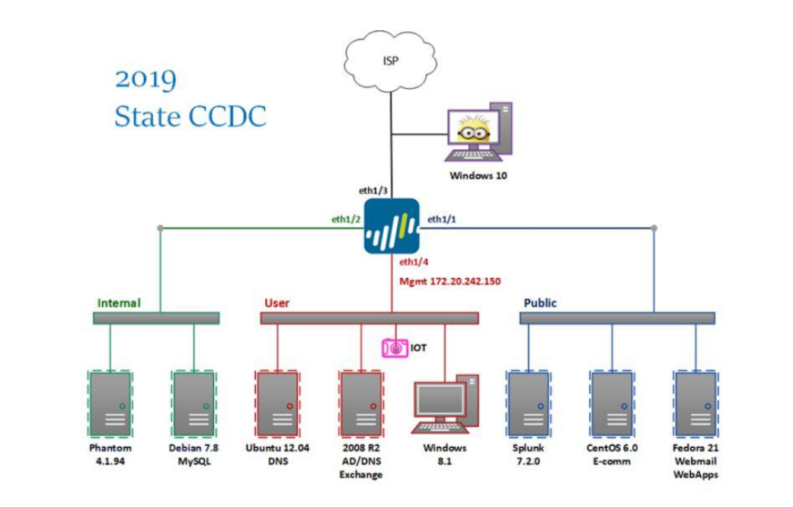

# CCDC Handbook

## Current Homework

* Get a Virtual Machine of your OS.
* Read
    * https://wiki.archlinux.org/
    * https://www.digitalocean.com/docs/

## Things to know how to do on your box

#### Know how to get System information 
- What is your system/name?
- What is the version?
- Who are the users are on the machine right now?
- What running processes are there?
- What Ports are opened and closed?
- How to change a port from open to closed and vise versa?

#### Know what attacks are common for your box

## Roles

* Team Captain
    * Gopher
        * Firewall Admin
        * Linux Admin
        * Windows Admin
        * Web Admin
        * Client Services
        * Incident Responder
This list is in order of importance 

## Schedule

### 12/3/18

#### Homework: 
* Get a Virtual Machine of your OS.
* Read
    * https://wiki.archlinux.org/
    * https://www.digitalocean.com/docs/

### 12/12/18 

#### Overview

* Ask the status of everyone's last assignment
* Discuss how to edit the handbook
* Discuss possible use of ESXI virtualization
* Discuss [How to Win CCDC](http://www.cs.mercer.edu/courses/david%20cozart/Cyber%20Defense/How%20to%20win%20CCDC.pdf)
* Configure boxes at IUS

#### Homework

* Configure your service on your own VM
* Lookup hardening for your service and save it on the handbook
* Read the resources in the Resources link

### 12/19/18 

#### Overview
* Figure out new schedules from 1/9 on since classes start Jan 7th.

### 12/26/18

### 01/2/19

### 01/09/19 - Tentative

### 01/16/19 - Tentative

### 01/23/19 - Tentative

### 01/30/19 - Tentative

### 02/02/19  - CCDC Competition

