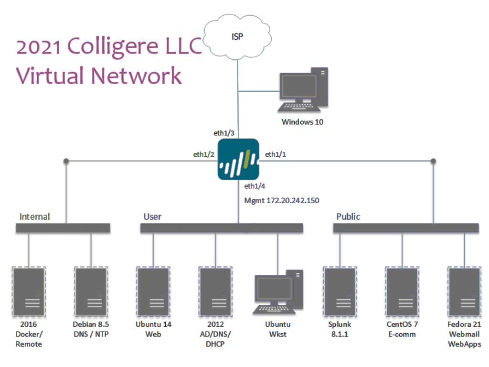

# CCDC Handbook

## Current Homework

* Get a Virtual Machine of your OS.

## Things to know how to do on your box

#### Know how to get System information 
- What is your system/name?
- What is the version?
- Who are the users are on the machine right now?
- What services are running, and how are they managed?
- What ports are opened and closed?
- How do configure a simple stateful firewall, such as iptables

#### Know what attacks are common for your box

## Roles

* Team Captain
* Firewall Admin
* Linux Web Admin
* Linux Splunk Admin
* Windows Active Directory Admin
* Linux Mail Admin
* Linux Database Admin
* Inject Writier 
* Incident Responder
(Ranked in order of difficulty)
## Schedule

### To be determined

